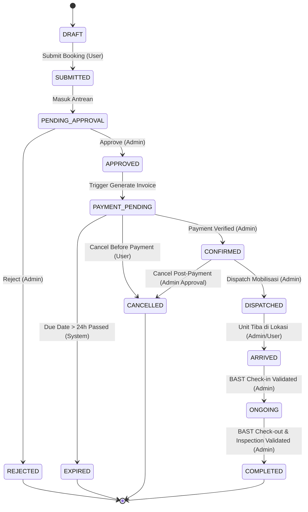
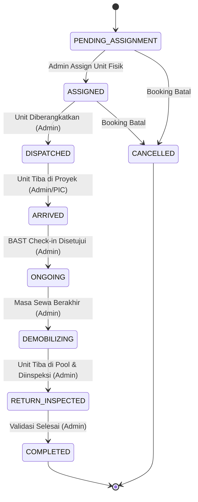
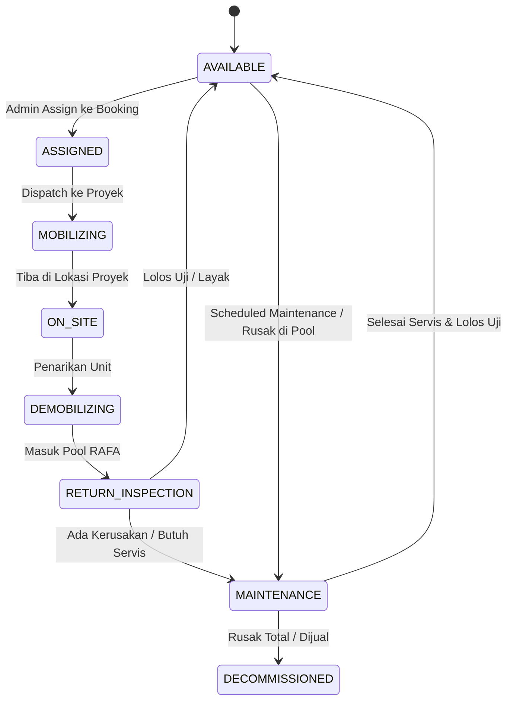
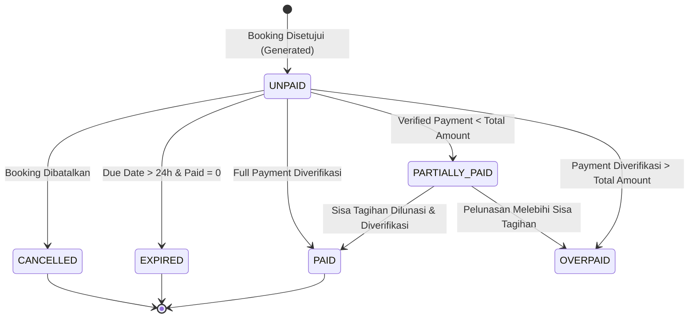
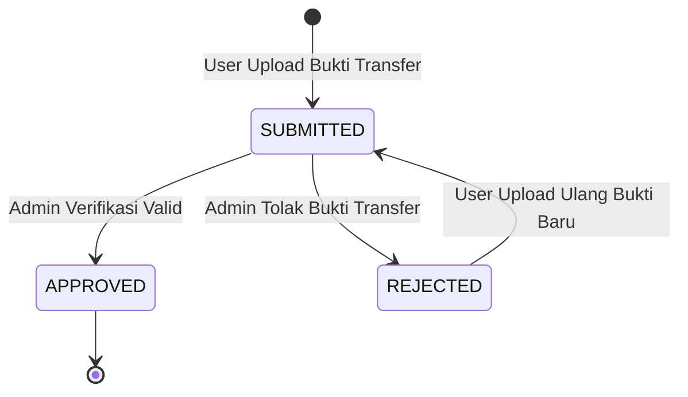
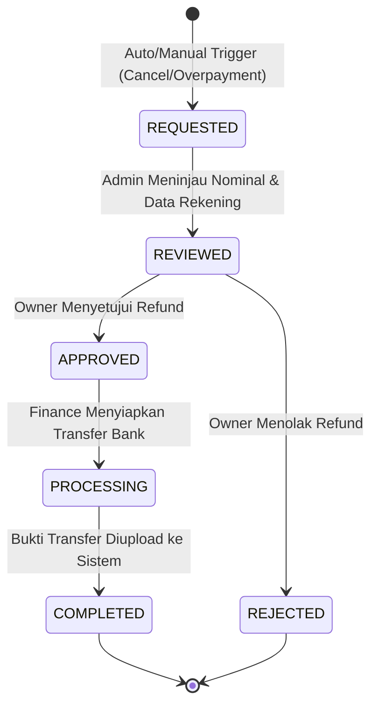

# State Machine Specification V3 - RAFA Rental System

Dokumen spesifikasi formal seluruh lifecycle dan state transitions untuk entitas kritis RAFA Rental System (Phase 1C).

---

## 1. Booking State Machine

### 1.1 State Definition
- **DRAFT:** Keranjang tersimpan, belum di-submit oleh user.
- **SUBMITTED / PENDING_APPROVAL:** Booking diajukan, menunggu telaah dan persetujuan Admin.
- **REJECTED:** Booking ditolak oleh Admin (alasan dicatat, kuota dilepas).
- **APPROVED / PAYMENT_PENDING:** Booking disetujui, invoice resmi 24 jam diterbitkan, menunggu pembayaran.
- **CONFIRMED:** Pembayaran (lunas / DP sah) telah diverifikasi dan disetujui Admin.
- **DISPATCHED:** Unit fisik telah di-assign dan sedang dalam perjalanan mobilisasi menuju lokasi proyek.
- **ARRIVED:** Unit telah sampai di lokasi proyek dan proses serah terima (BAST Check-in) sedang berlangsung.
- **ONGOING:** BAST Check-in selesai divalidasi; unit aktif beroperasi di lokasi proyek.
- **COMPLETED:** Masa sewa berakhir, BAST Check-out selesai, inspeksi akhir tuntas, seluruh tagihan/denda lunas.
- **CANCELLED:** Dibatalkan sebelum mobilisasi (oleh user sebelum bayar, atau via persetujuan Admin jika pasca-bayar).
- **EXPIRED:** Batas waktu bayar 24 jam habis tanpa pembayaran yang sah. Kuota otomatis dilepas.

### 1.2 Diagram Mermaid - Booking Lifecycle

### 1.3 Transisi Detail & Aturan Booking

#### T-B01: DRAFT -> SUBMITTED (PENDING_APPROVAL)
- **Actor:** USER
- **Preconditions:** User terverifikasi (BR-001), item cart valid (BR-007), lokasi proyek terisi lengkap (BR-003, BR-004), kuota tersedia (BR-011).
- **Next State:** `PENDING_APPROVAL`
- **Side Effect:** Kuota kapasitas tipe alat dikunci sementara (*soft-lock*).
- **Notification:** Kirim email/notifikasi ke Admin bahwa ada booking baru.
- **Audit:** Catat log event `BOOKING_SUBMITTED`.
- **Forbidden Transition:** Submit jika cart kosong atau kuota habis.

#### T-B02: PENDING_APPROVAL -> APPROVED (PAYMENT_PENDING)
- **Actor:** ADMIN
- **Preconditions:** Verifikasi ketersediaan armada dan jadwal proyek valid.
- **Next State:** `PAYMENT_PENDING`
- **Side Effect:** Generate invoice dengan `due_at = NOW() + 24 hours` (BR-021, BR-022).
- **Notification:** Kirim instruksi pembayaran dan invoice PDF ke User.
- **Audit:** Catat log event `BOOKING_APPROVED` beserta ID Admin.
- **Forbidden Transition:** Approve tanpa penerbitan invoice.

#### T-B03: PENDING_APPROVAL -> REJECTED
- **Actor:** ADMIN
- **Preconditions:** Admin mengisi alasan penolakan wajib.
- **Next State:** `REJECTED`
- **Side Effect:** Soft-lock kuota alat dilepas seketika (BR-012).
- **Notification:** Kirim alasan penolakan ke User.
- **Audit:** Catat log event `BOOKING_REJECTED` dengan reason note.
- **Forbidden Transition:** Reject tanpa catatan alasan.

#### T-B04: PAYMENT_PENDING -> CONFIRMED
- **Actor:** Sistem / ADMIN
- **Preconditions:** Pembayaran terverifikasi dan memenuhi syarat (Lunas / DP sah) (BR-024).
- **Next State:** `CONFIRMED`
- **Side Effect:** Reservasi kuota terkunci permanen; status invoice terupdate.
- **Notification:** Kirim konfirmasi pembayaran sukses ke User.
- **Audit:** Catat log event `BOOKING_CONFIRMED`.
- **Forbidden Transition:** Pindah ke `CONFIRMED` jika pembayaran berstatus `REJECTED` atau nominal kurang tanpa izin DP.

#### T-B05: PAYMENT_PENDING -> EXPIRED
- **Actor:** Sistem (Cron Scheduler)
- **Preconditions:** Timestamp sekarang > `invoices.due_at` dan status invoice masih `UNPAID` (BR-010, BR-022).
- **Next State:** `EXPIRED`
- **Side Effect:** Invoice berstatus `EXPIRED`, kuota reservasi dilepas otomatis ke pool publik (BR-012).
- **Notification:** Kirim notifikasi booking kadaluwarsa ke User.
- **Audit:** Catat log event `BOOKING_AUTO_EXPIRED`.
- **Forbidden Transition:** Expire booking yang sudah berstatus `CONFIRMED`.

#### T-B06: PAYMENT_PENDING / CONFIRMED -> CANCELLED
- **Actor:** USER (sebelum bayar), ADMIN (setelah bayar)
- **Preconditions:**
  - Sebelum bayar: User dapat langsung membatalkan mandiri (BR-028).
  - Setelah bayar: User mengajukan pembatalan, Admin menyetujui pembatalan sebelum unit berstatus `DISPATCHED`.
- **Next State:** `CANCELLED`
- **Side Effect:** Kuota dan assignment unit dilepas (BR-012); buat draft refund manual jika sudah ada pembayaran (BR-027).
- **Notification:** Notifikasi pembatalan booking dan info refund ke User.
- **Audit:** Catat log event `BOOKING_CANCELLED`.
- **Forbidden Transition:** **DILARANG CANCEL JIKA BOOKING SUDAH BERSTATUS `DISPATCHED`, `ARRIVED`, ATAU `ONGOING`**.

#### T-B07: CONFIRMED -> DISPATCHED
- **Actor:** ADMIN
- **Preconditions:** Seluruh physical unit pada booking telah di-assign oleh Admin (BR-013).
- **Next State:** `DISPATCHED`
- **Side Effect:** Status rental dan unit fisik berubah menjadi mobilisasi/dispatch.
- **Notification:** Notifikasi ke User bahwa unit dalam perjalanan ke lokasi.
- **Audit:** Catat log event `BOOKING_DISPATCHED`.
- **Forbidden Transition:** Dispatch jika physical unit belum selesai di-assign.

#### T-B08: DISPATCHED -> ARRIVED
- **Actor:** ADMIN / PIC Lapangan
- **Preconditions:** Unit fisik sampai di lokasi proyek.
- **Next State:** `ARRIVED`
- **Side Effect:** Menunggu tanda tangan BAST Check-in.
- **Notification:** Notifikasi unit tiba di lokasi proyek.
- **Audit:** Catat log event `BOOKING_ARRIVED`.
- **Forbidden Transition:** Langsung loncat ke `ONGOING` tanpa state `ARRIVED`.

#### T-B09: ARRIVED -> ONGOING
- **Actor:** ADMIN
- **Preconditions:** Dokumen BAST Check-in, foto kondisi unit, dan Hour Meter (HM) awal terverifikasi (BR-015).
- **Next State:** `ONGOING`
- **Side Effect:** Periode sewa aktif berjalan; input timesheet diizinkan (BR-016).
- **Notification:** Notifikasi masa sewa aktif.
- **Audit:** Catat log event `RENTAL_STARTED_ONGOING`.
- **Forbidden Transition:** Ongoing tanpa upload BAST Check-in.

#### T-B10: ONGOING -> COMPLETED
- **Actor:** ADMIN
- **Preconditions:** Masa sewa berakhir, BAST Check-out tervalidasi, unit telah diinspeksi kembali di pool, dan seluruh tagihan/timesheet lunas (BR-015, BR-018).
- **Next State:** `COMPLETED`
- **Side Effect:** Unit fisik kembali berstatus `AVAILABLE`; booking ditutup.
- **Notification:** Kirim rekapitulasi penyelesaian sewa ke User.
- **Audit:** Catat log event `BOOKING_COMPLETED`.
- **Forbidden Transition:** Completed jika unit masih berada di lokasi proyek atau inspeksi belum selesai.

---

## 2. Rental State Machine (Per Rental Item / Line)

Rental merefleksikan lifecycle operasional per item peralatan yang disewa. Membedakan secara tegas antara masa perjalanan (`DISPATCHED`), tiba di proyek (`ARRIVED`), dan masa operasi aktif (`ONGOING`).

### 2.1 State Definition
- **PENDING_ASSIGNMENT:** Menunggu alokasi unit fisik dari Admin.
- **ASSIGNED:** Unit fisik spesifik telah ditentukan.
- **DISPATCHED:** Unit fisik diberangkatkan dari pool (dalam perjalanan mobilisasi).
- **ARRIVED:** Unit sampai di lokasi proyek, proses handover berlangsung.
- **ONGOING:** BAST Check-in disetujui, unit bekerja/siap kerja di proyek.
- **DEMOBILIZING:** Masa sewa selesai, unit dalam perjalanan pulang ke pool.
- **RETURN_INSPECTED:** Unit sampai di pool dan selesai diperiksa kondisi fisiknya.
- **COMPLETED:** Operasional rental item selesai sempurna.
- **CANCELLED:** Rental item dibatalkan sebelum proses dispatch.

### 2.2 Diagram Mermaid - Rental Lifecycle

### 2.3 Aturan Kritis Rental
1. **Pemisahan Tegas:** `DISPATCHED` (di jalan menuju lokasi) != `ARRIVED` (tiba di lokasi) != `ONGOING` (resmi beroperasi pasca-BAST).
2. **Larangan Pembatalan:** Pembatalan dilarang mutlak begitu status menyentuh `DISPATCHED`.

---

## 3. Equipment Unit State Machine (Physical Unit)

Physical Unit adalah aset fisik individual (No Seri / No Lambung).

### 3.1 State Definition
- **AVAILABLE:** Unit berada di pool, kondisi prima, siap dialokasikan.
- **ASSIGNED:** Unit diikatkan pada booking yang telah lunas/disetujui.
- **MOBILIZING:** Unit sedang diangkut menuju lokasi proyek penyewa.
- **ON_SITE:** Unit berada di lokasi proyek penyewa.
- **DEMOBILIZING:** Unit sedang diangkut kembali dari lokasi proyek menuju pool.
- **RETURN_INSPECTION:** Unit tiba di pool dan sedang melalui inspeksi fisik & kelayakan teknis.
- **MAINTENANCE:** Unit mengalami kerusakan / masuk jadwal servis rutin.
- **DECOMMISSIONED:** Unit dihapus permanen dari inventaris aktif.

### 3.2 Diagram Mermaid - Physical Unit Lifecycle

### 3.3 Aturan Kritis Physical Unit
1. **Syarat Status AVAILABLE:** Unit **HANYA DAPAT** kembali berstatus `AVAILABLE` setelah melalui tahapan `RETURN_INSPECTION` dan dinyatakan lulus inspeksi teknis.
2. **Isolasi Maintenance:** Unit dalam status `MAINTENANCE` atau `DECOMMISSIONED` tidak dapat dipilih oleh Admin pada modul Unit Assignment.

---

## 4. Invoice State Machine

### 4.1 State Definition
- **UNPAID:** Invoice diterbitkan, menunggu pembayaran user (Deadline 24 jam).
- **PARTIALLY_PAID:** Pembayaran DP/sebagian telah diverifikasi, sisa tagihan > 0.
- **PAID:** Tagihan telah lunas 100% (Total verified payments == Invoice amount).
- **OVERPAID:** Pembayaran terverifikasi melebihi total tagihan (Menunggu tindakan manual Admin/Owner).
- **EXPIRED:** Batas waktu 24 jam terlewati tanpa pembayaran yang sah.
- **CANCELLED:** Invoice dibatalkan akibat pembatalan booking.

### 4.2 Diagram Mermaid - Invoice Lifecycle

### 4.3 Aturan Kritis Invoice
1. **Trigger Penerbitan:** Invoice hanya boleh dibuat saat Booking beralih ke `APPROVED` (BR-021).
2. **Kekekalan Deadline (Timer Invariance):** `due_at` terkunci 24 jam dari waktu awal create invoice. Rejection bukti bayar tidak mereset timer ini (BR-022, BR-025).

---

## 5. Payment State Machine

Merefleksikan lifecycle setiap upload bukti bayar individual.

### 5.1 State Definition
- **PENDING / SUBMITTED:** Bukti transfer diunggah oleh User, menunggu verifikasi Admin.
- **APPROVED:** Bukti transfer dinyatakan valid dan dana telah masuk mutasi bank.
- **REJECTED:** Bukti transfer ditolak (palsu/dana tidak masuk/salah rekening).

### 5.2 Diagram Mermaid - Payment Lifecycle

### 5.3 Aturan Kritis Payment
1. **Rejection Handling:** Ketika payment ditolak (`REJECTED`), invoice tetap berstatus `UNPAID` / `PARTIALLY_PAID` dan user dapat mengunggah bukti baru selama `invoices.due_at` belum terlewati (BR-025).
2. **Deadline Immutability:** Penolakan payment **TIDAK MERESET** batas waktu 24 jam invoice.
3. **Kardinalitas:** 1 Invoice dapat memiliki banyak record Payment; 1 Payment hanya terikat ke 1 Invoice (BR-023).

---

## 6. Refund State Machine

Refund memiliki lifecycle tersendiri dan dieksekusi secara manual via transfer bank.

### 6.1 State Definition
- **REQUESTED:** Pengajuan refund dibuat (akibat pembatalan booking atau kelebihan bayar).
- **REVIEWED:** Ditinjau oleh Admin (perhitungan potongan biaya/penalti jika ada).
- **APPROVED:** Disetujui oleh Owner untuk pencairan dana.
- **PROCESSING:** Admin/Finance memproses transfer perbankan secara manual.
- **COMPLETED:** Dana berhasil ditransfer ke rekening user dan bukti transfer diunggah ke sistem.
- **REJECTED:** Pengajuan refund ditolak dengan alasan resmi dari Owner/Admin.

### 6.2 Diagram Mermaid - Refund Lifecycle

### 6.3 Aturan Kritis Refund
1. **Manual Transfer:** Eksekusi transfer wajib manual oleh Admin/Owner; sistem mencatat nomor referensi bank dan file bukti transfer (BR-027).

---

## 7. Master State Transition Matrix

| Entitas | Current State | Action / Event | Allowed Role | Next State | Catatan Validasi |
|---|---|---|---|---|---|
| **Booking** | DRAFT | Submit Booking | USER | PENDING_APPROVAL | Cek kelengkapan & ketersediaan kuota |
| **Booking** | PENDING_APPROVAL | Approve Booking | ADMIN | PAYMENT_PENDING | Auto-generate Invoice 24 jam |
| **Booking** | PENDING_APPROVAL | Reject Booking | ADMIN | REJECTED | Wajib cantumkan alasan tolak |
| **Booking** | PAYMENT_PENDING | Payment Validated | ADMIN / Sistem | CONFIRMED | Pembayaran lunas / DP valid |
| **Booking** | PAYMENT_PENDING | Cron Due Date Check | SISTEM | EXPIRED | Waktu > 24 jam; auto-release kuota |
| **Booking** | PAYMENT_PENDING | Cancel Order | USER | CANCELLED | Batal sebelum bayar |
| **Booking** | CONFIRMED | Cancel Order | ADMIN | CANCELLED | Batal pasca bayar; trigger refund flow |
| **Booking** | CONFIRMED | Dispatch All Units | ADMIN | DISPATCHED | Physical units wajib sudah di-assign |
| **Booking** | DISPATCHED | Arrival Confirmation | ADMIN / PIC | ARRIVED | Unit sampai di lokasi proyek |
| **Booking** | ARRIVED | Validate BAST In | ADMIN | ONGOING | Upload foto kondisi & start HM |
| **Booking** | ONGOING | Reschedule Request | USER / ADMIN | ONGOING / PENDING_APPROVAL | Wajib cek availability jadwal baru |
| **Booking** | ONGOING | Validate BAST Out | ADMIN | COMPLETED | Unit kembali ke pool & lolos inspeksi |
| **Rental** | PENDING_ASSIGNMENT| Assign Physical Unit | ADMIN | ASSIGNED | Pilih unit berstatus AVAILABLE |
| **Rental** | ASSIGNED | Mobilize Unit | ADMIN | DISPATCHED | Unit diberangkatkan ke proyek |
| **Rental** | DISPATCHED | Arrive at Site | ADMIN / PIC | ARRIVED | Handover pra-operasi |
| **Rental** | ARRIVED | Approve BAST In | ADMIN | ONGOING | Mulai masa sewa aktif |
| **Rental** | ONGOING | Demobilize Unit | ADMIN | DEMOBILIZING | Penarikan unit ke pool |
| **Rental** | DEMOBILIZING | Receive at Pool | ADMIN | RETURN_INSPECTED| Unit masuk karantina inspeksi |
| **Rental** | RETURN_INSPECTED| Complete Inspection | ADMIN | COMPLETED | Lolos cek fisik & administrasi |
| **Physical Unit**| AVAILABLE | Assign to Booking | ADMIN | ASSIGNED | Unit terkunci jadwal |
| **Physical Unit**| ASSIGNED | Dispatch | ADMIN | MOBILIZING | Unit dalam perjalanan |
| **Physical Unit**| MOBILIZING | Handover at Site | ADMIN / PIC | ON_SITE | Unit bekerja di proyek |
| **Physical Unit**| ON_SITE | Demobilize | ADMIN | DEMOBILIZING | Unit dalam perjalanan pulang |
| **Physical Unit**| DEMOBILIZING | Arrive at Pool | ADMIN | RETURN_INSPECTION| Karantina penerimaan |
| **Physical Unit**| RETURN_INSPECTION| Pass Inspection | ADMIN | AVAILABLE | Kondisi siap sewa kembali |
| **Physical Unit**| RETURN_INSPECTION| Fail Inspection | ADMIN | MAINTENANCE | Masuk bengkel / perbaikan |
| **Physical Unit**| MAINTENANCE | Repair Complete | ADMIN | AVAILABLE | Lolos uji teknis |
| **Invoice** | UNPAID | System Generated | SISTEM | UNPAID | Created at Booking Approved |
| **Invoice** | UNPAID | Partial Pay Validated| ADMIN | PARTIALLY_PAID | Sisa tagihan > 0 |
| **Invoice** | UNPAID / PARTIAL| Full Pay Validated | ADMIN | PAID | Sisa tagihan = 0 |
| **Invoice** | UNPAID / PARTIAL| Overpay Validated | ADMIN | OVERPAID | Pembayaran melebihi total invoice |
| **Invoice** | UNPAID | Timeout > 24 Hours | SISTEM | EXPIRED | Triggered by cron job |
| **Payment** | NONE | Upload Proof | USER | SUBMITTED | File bukti transfer valid |
| **Payment** | SUBMITTED | Approve Payment | ADMIN | APPROVED | Mutasi bank terkonfirmasi |
| **Payment** | SUBMITTED | Reject Payment | ADMIN | REJECTED | Wajib alasan tolak; deadline tetap |
| **Refund** | NONE | Trigger Refund | SISTEM / ADMIN | REQUESTED | Dari cancel atau overpayment |
| **Refund** | REQUESTED | Review Request | ADMIN | REVIEWED | Hitung penalti/potongan jika ada |
| **Refund** | REVIEWED | Approve Refund | OWNER | APPROVED | Persetujuan pengeluaran dana |
| **Refund** | APPROVED | Process Bank Transfer| ADMIN / FINANCE| PROCESSING | Transfer manual via bank |
| **Refund** | PROCESSING | Upload Bank Proof | ADMIN / FINANCE| COMPLETED | Bukti transfer terunggah |

---

## 8. Pemeriksaan Keselarasan terhadap 01-business-rules-v3.md

| Butir Aturan | Status | Validasi Keselarasan State Machine |
|---|---|---|
| **Payment Rejection & Deadline** | **SESUAI** | Rejection mengubah payment ke `REJECTED`, invoice tetap `UNPAID`/`PARTIALLY_PAID`. Timer `due_at` tidak berubah (BR-025). |
| **Auto Expiration & Release** | **SESUAI** | Expiration via scheduler mengubah status ke `EXPIRED` dan melepaskan seluruh kuota/unit (BR-010, BR-012). |
| **Aturan Pembatalan (Cancellation)** | **SESUAI** | Batal sebelum bayar diizinkan via user; batal pasca bayar butuh approval admin; **batal dilarang setelah DISPATCHED** (BR-028). |
| **Pemisahan Dispatch vs Ongoing** | **SESUAI** | State terpisah jelas: `DISPATCHED` -> `ARRIVED` -> `ONGOING` (BR-014, BR-015). |
| **Syarat Status Unit AVAILABLE** | **SESUAI** | Unit fisik wajib melalui `DEMOBILIZING` -> `RETURN_INSPECTION` sebelum dapat berpindah kembali ke `AVAILABLE` (BR-006). |
| **Reschedule dengan Approval & Availability** | **SESUAI** | Reschedule wajib mengecek ketersediaan buffer dan butuh persetujuan admin (BR-029). |
| **Partial & Overpayment Handling** | **SESUAI** | State invoice mendukung `PARTIALLY_PAID` dan `OVERPAID` dengan verifikasi manual (BR-024, BR-026). |
| **Lifecycle Refund Terisolasi** | **SESUAI** | Refund memiliki 6 state independen dengan eksekusi manual (BR-027). |
