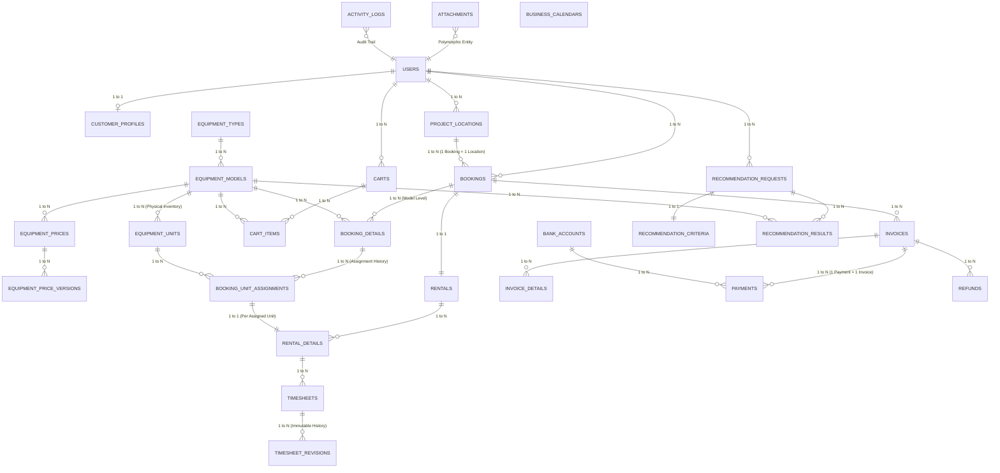

# Entity Relationship Diagram (ERD) Specification V3 - RAFA Rental System

Dokumen spesifikasi arsitektur data, model relasional, kardinalitas, dan integritas referensial untuk RAFA Rental System (Phase 1E).

---

## 1. Visualisasi ERD (Mermaid)

---

## 2. Matriks Kardinalitas & Integritas Relasi

| Relasi Parent | Relasi Child | Kardinalitas | Foreign Key | On Delete | On Update | Penjelasan Bisnis & Teknis |
|---|---|---|---|---|---|---|
| `users` | `customer_profiles` | 1 : 0..1 | `user_id` | CASCADE | CASCADE | Profil dihapus jika akun user dihapus. |
| `users` | `project_locations` | 1 : 0..N | `user_id` | RESTRICT | CASCADE | Lokasi proyek milik user; dilarang hapus jika ada relasi. |
| `project_locations` | `bookings` | 1 : 0..N | `project_location_id` | RESTRICT | CASCADE | **Aturan BR-003:** 1 Booking = 1 Project Location. Dilarang hapus lokasi jika ada riwayat booking. |
| `equipment_types` | `equipment_models` | 1 : 0..N | `equipment_type_id` | RESTRICT | CASCADE | Tipe alat mengelompokkan model alat (misal: Excavator -> PC200). |
| `equipment_models` | `equipment_units` | 1 : 0..N | `equipment_model_id` | RESTRICT | CASCADE | Model alat memiliki banyak nomor seri unit fisik. |
| `equipment_models` | `equipment_prices` | 1 : 0..N | `equipment_model_id` | CASCADE | CASCADE | Master tarif sewa per model alat. |
| `equipment_prices` | `equipment_price_versions`| 1 : 1..N | `equipment_price_id` | CASCADE | CASCADE | Versi harga historis (mencegah mutasi harga masa lalu). |
| `carts` | `cart_items` | 1 : 0..N | `cart_id` | CASCADE | CASCADE | Item keranjang terhapus jika cart dibersihkan. |
| `users` | `bookings` | 1 : 0..N | `user_id` | RESTRICT | CASCADE | Riwayat booking user dilarang terhapus sembarangan. |
| `bookings` | `booking_details` | 1 : 1..N | `booking_id` | CASCADE | CASCADE | Item rincian booking level model/tipe alat. |
| `equipment_models` | `booking_details` | 1 : 0..N | `equipment_model_id` | RESTRICT | CASCADE | User memesan spesifikasi model, bukan unit fisik. |
| `booking_details` | `booking_unit_assignments`| 1 : 0..N | `booking_detail_id` | RESTRICT | CASCADE | Admin menetapkan unit fisik ke line booking. Jika diganti, re-assignment membuat baris baru. |
| `equipment_units` | `booking_unit_assignments`| 1 : 0..N | `equipment_unit_id` | RESTRICT | CASCADE | Unit fisik dilarang dihapus jika pernah dialokasikan. |
| `bookings` | `rentals` | 1 : 0..1 | `booking_id` | RESTRICT | CASCADE | Entitas operasional lapangan booking. |
| `rentals` | `rental_details` | 1 : 1..N | `rental_id` | CASCADE | CASCADE | Baris operasional per unit yang bertugas di lapangan. |
| `booking_unit_assignments`| `rental_details` | 1 : 1 | `assignment_id` | RESTRICT | CASCADE | 1 Assignment unit fisik aktif memegang 1 operasional rental detail. |
| `rental_details` | `timesheets` | 1 : 0..N | `rental_detail_id` | RESTRICT | CASCADE | Timesheet harian dicatat per unit fisik yang beroperasi. |
| `timesheets` | `timesheet_revisions` | 1 : 0..N | `timesheet_id` | CASCADE | CASCADE | **Aturan BR-017:** Revisi timesheet mencatat histori lengkap tanpa hapus data lama. |
| `bookings` | `invoices` | 1 : 1..N | `booking_id` | RESTRICT | CASCADE | Invoice diterbitkan pasca-booking disetujui. |
| `invoices` | `invoice_details` | 1 : 1..N | `invoice_id` | CASCADE | CASCADE | Komponen baris tagihan snapshot. |
| `invoices` | `payments` | 1 : 0..N | `invoice_id` | RESTRICT | CASCADE | **Aturan BR-023:** 1 Invoice bisa banyak payment (partial); 1 Payment HANYA untuk 1 Invoice. |
| `bank_accounts` | `payments` | 1 : 0..N | `bank_account_id` | RESTRICT | CASCADE | Rekening tujuan transfer perusahaan. |
| `invoices` | `refunds` | 1 : 0..N | `invoice_id` | RESTRICT | CASCADE | Pengembalian dana terikat ke invoice terkait. |
| `users` | `recommendation_requests` | 1 : 0..N | `user_id` | CASCADE | CASCADE | Riwayat rekomendasi alat cerdas user. |
| `recommendation_requests` | `recommendation_criteria`| 1 : 1 | `request_id` | CASCADE | CASCADE | Parameter beban, medan, dan kebutuhan kapasitas. |
| `recommendation_requests` | `recommendation_results` | 1 : 0..N | `request_id` | CASCADE | CASCADE | Daftar rekomendasi alat terpilih berserta skor kecocokan. |

---

## 3. Skema Proteksi Data Finansial (Financial Snapshot Immutability)

Untuk menjamin kepatuhan audit dan integritas keuangan:
1. **Pemisahan Master vs Transaksional:** Tabel `equipment_prices` dan `equipment_price_versions` hanya berlaku untuk kalkulasi booking baru.
2. **Snapshot Kolom Finansial:**
   - Tabel `booking_details` menyimpan: `rental_rate_snapshot`, `mob_demob_cost_snapshot`, `is_all_in`, `subtotal`.
   - Tabel `invoice_details` menyimpan: `unit_price`, `quantity`, `subtotal`, `tax_amount`.
   - Tabel `invoices` menyimpan: `subtotal`, `tax_total`, `discount_total`, `grand_total`, `paid_amount`, `overpayment_amount`.
3. **Immutabilitas Total:** Perubahan harga di master data `equipment_prices` **TIDAK AKAN PERNAH** memengaruhi nilai nominal pada booking dan invoice yang telah berstatus `APPROVED` atau `ISSUED`.

---

## 4. Mekanisme Assignment Unit & Histori Mutasi

Sesuai aturan **BR-008** dan **BR-013**:
1. User memesan kapasitas tipe model (`booking_details.equipment_model_id`).
2. Admin mengalokasikan unit fisik melalui tabel `booking_unit_assignments`:
   - Kolom `status`: `ASSIGNED`, `REPLACED`, `CANCELLED`, `COMPLETED`.
   - Kolom `is_current`: boolean (1 = unit aktif saat ini, 0 = riwayat penggantian).
3. Jika unit fisik rusak pra-dispatch dan diganti:
   - Baris assignment lama diubah `status = 'REPLACED'`, `is_current = 0`, dicatat `replaced_reason` dan `replaced_at`.
   - Baris assignment baru dibuat dengan `equipment_unit_id` pengganti dan `is_current = 1`.
   - Histori penugasan unit tetap utuh untuk kebutuhan jejak audit.

---

## 5. Skema Relasi Polimorfik

### 5.1 Attachments (`attachments`)
Digunakan untuk mengaitkan dokumen file secara fleksibel:
- `attachable_type`: String nama model (`UserProfile`, `Payment`, `RentalHandover`, `Timesheet`, `EquipmentUnit`).
- `attachable_id`: Unsigned Big Integer ID record terkait.
- Kolom: `file_path`, `file_name`, `mime_type`, `file_size`, `document_type` (`KTP`, `NPWP`, `PAYMENT_PROOF`, `BAST_IN`, `BAST_OUT`, `INSPECTION_PHOTO`).

### 5.2 Activity Logs (`activity_logs`)
Merekam seluruh jejak perubahan audit:
- `subject_type` dan `subject_id`: Record yang dimutasi (`Booking`, `Invoice`, `Payment`, `Timesheet`).
- `causer_type` dan `causer_id`: Aktor yang melakukan mutasi (`User`).
- `properties`: JSON snapshot data sebelum (`old`) dan sesudah (`attributes`).

---

## 6. Pemeriksaan Konsistensi (Consistency Check)

| Persyaratan Sistem | Status | Validasi ERD |
|---|---|---|
| **1 Booking = 1 Project Location** | **SESUAI** | `bookings.project_location_id` (FK NOT NULL tunggal). Tidak ada tabel junction multi-lokasi. |
| **Abstraksi Unit Fisik** | **SESUAI** | `booking_details` mengikat ke `equipment_model_id`. Relasi ke `equipment_units` dilakukan via tabel terpisah `booking_unit_assignments`. |
| **Kardinalitas Invoice & Payment** | **SESUAI** | `payments.invoice_id` (FK NOT NULL tunggal). 1 Invoice dapat berelasi ke banyak baris `payments`. Partial payment didukung penuh. |
| **Histori Timesheet Terjaga** | **SESUAI** | `timesheets` (1) ke (N) `timesheet_revisions`. Revisi tidak pernah meng-overwrite log masa lalu. |
| **Pemisahan Dispatch vs Ongoing** | **SESUAI** | Status rental tercermin di `rentals.status` dan `rental_details.status` (`DISPATCHED`, `ARRIVED`, `ONGOING`). |
| **Unit Hanya Available Pasca Inspeksi** | **SESUAI** | State unit fisik `equipment_units.status` mewajibkan status `RETURN_INSPECTION` sebelum beralih ke `AVAILABLE`. |
| **Tipe Data Moneter** | **SESUAI** | Seluruh atribut finansial didefinisikan sebagai `DECIMAL(15,2)`, tanpa float/double. |
