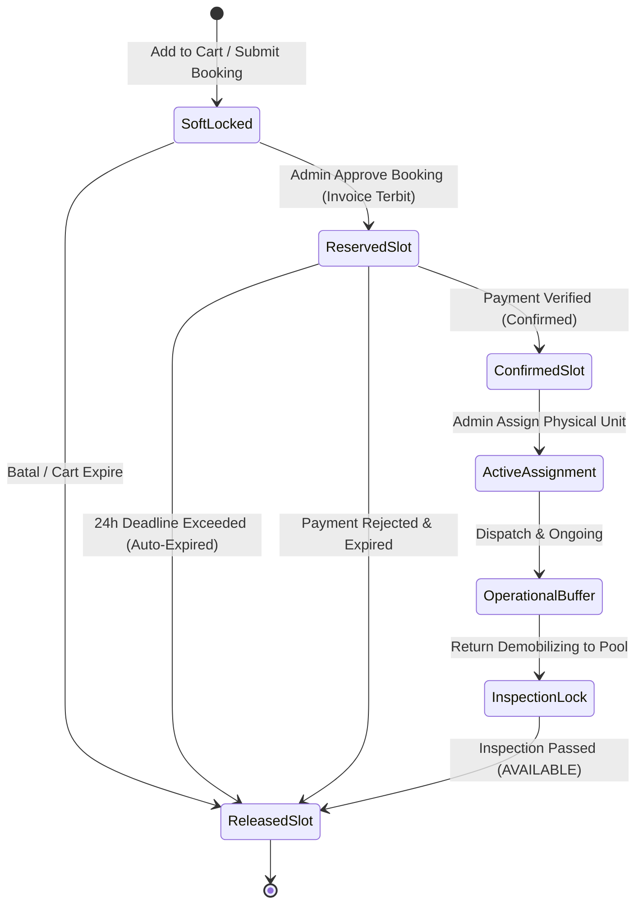

# Availability & Concurrency Specification V3 - RAFA Rental System

Dokumen spesifikasi arsitektur kalkulasi ketersediaan armada (*availability*), manajemen kapasitas, dan strategi konkurensi data (Phase 1G).

---

## 1. Prinsip Sumber Kebenaran (Source of Truth)

1. **MySQL sebagai Sumber Kebenaran Tunggal:** Seluruh kalkulasi ketersediaan unit dan kuota sewa dihitung langsung dari basis data relasional MySQL 8.4.
2. **Zero Redis Dependency for Correctness:** Sistem tidak boleh mengandalkan Redis / In-memory Cache eksternal untuk validasi ketersediaan atau integritas transaksi sewa. Jika caching digunakan di masa depan, caching hanya bertindak sebagai *read-cache* akselerasi yang dapat di-evict sewaktu-waktu tanpa menyebabkan *overselling* atau *double-booking*.

---

## 2. Arsitektur Dua Lapis Ketersediaan (Two-Layer Availability)

Sistem membedakan kalkulasi ketersediaan menjadi dua lapisan independen:

### 2.1 Model-Level Availability (Lapisan Pengguna / Katalog)
Pengguna tidak memilih unit fisik. Pada level katalog, cart, dan checkout booking, ketersediaan dihitung berdasarkan agregat kuota tipe model peralatan (`equipment_models`):

$$\text{AvailableCapacity}(M, [T_{\text{start}}, T_{\text{end}}]) = N_{\text{active}}(M) - N_{\text{committed}}(M, [T_{\text{start}}, T_{\text{end}}])$$

Dimana:
- $N_{\text{active}}(M)$: Total unit fisik aktif model $M$ yang tidak berstatus `DECOMMISSIONED`.
- $N_{\text{committed}}(M, [T_{\text{start}}, T_{\text{end}}])$: Jumlah unit yang sedang terikat komitmen pada rentang waktu tersebut, mencakup:
  1. Unit dalam status `MAINTENANCE` terjadwal yang bertabrakan dengan rentang sewa.
  2. Booking berstatus `CONFIRMED`, `DISPATCHED`, `ARRIVED`, `ONGOING` yang menggunakan model $M$ pada rentang waktu (termasuk buffer).
  3. Booking berstatus `APPROVED` / `PAYMENT_PENDING` yang masih dalam masa tenggang waktu pembayaran (`invoices.due_at > NOW()`).

### 2.2 Physical-Unit Availability (Lapisan Admin / Alokasi Inventaris)
Admin memilih unit fisik spesifik (`equipment_units`) melalui modul Unit Assignment. Sebuah unit fisik $U$ dinyatakan **AVAILABLE** untuk dialokasikan pada rentang $[T_{\text{start}}, T_{\text{end}}]$ jika dan hanya jika memenuhi seluruh syarat berikut:
1. Status mutlak unit saat ini adalah `AVAILABLE`.
2. Unit tidak memiliki jadwal `MAINTENANCE` pada interval $[T_{\text{start}} - B_{\text{mob}}, T_{\text{end}} + B_{\text{demob}} + B_{\text{insp}}]$.
3. Unit tidak terikat pada record `booking_unit_assignments` lain yang aktif (`is_current = 1`) pada interval yang bertabrakan (termasuk buffer).

---

## 3. Komponen Waktu & Operational Buffer

Kalkulasi jadwal tidak boleh hanya memperhitungkan durasi kerja di lokasi, melainkan wajib memperhitungkan **Operational Buffer**:

| Buffer | Durasi Default | Kapan Diterapkan | Dampak Ketersediaan |
|---|---|---|---|
| **Mobilization Buffer ($B_{\text{mob}}$)** | Konfigurasi per Model (misal 1 hari) | Sebelum $T_{\text{start}}$ sewa | Unit fisik dikunci untuk persiapan pool, loading tronton, dan perjalanan ke site. |
| **Demobilization Buffer ($B_{\text{demob}}$)** | Konfigurasi per Model (misal 1 hari) | Setelah $T_{\text{end}}$ sewa | Unit fisik dikunci selama perjalanan penarikan dari site kembali ke pool. |
| **Return Inspection Buffer ($B_{\text{insp}}$)** | Konfigurasi Standar (misal 4-12 jam) | Setelah unit tiba di pool | Unit masuk status `RETURN_INSPECTION`. Unit **TIDAK BOLEH** langsung `AVAILABLE` sebelum inspeksi fisik dan uji fungsi selesai divalidasi. |

---

## 4. Lifecycle Slot Reservasi



### 4.1 Reserved Slot (Penguncian Kuota)
- Terjadi saat booking disetujui Admin (`APPROVED`) dan invoice 24 jam diterbitkan.
- Mengurangi kuota publik pada model terkait untuk mencegah perebutan armada oleh user lain.

### 4.2 Released Slot (Pelepasan Kuota Real-time)
- Terjadi otomatis saat:
  1. Scheduler mendeteksi invoice `due_at` lewat dari 24 jam tanpa bukti transfer valid (`EXPIRED`).
  2. Pembatalan booking disetujui (`CANCELLED`).
  3. Penolakan booking oleh Admin (`REJECTED`).
- Mengembalikan kuota ke pool publik dalam satu transaksi database atomik.

### 4.3 Unit Replacement & Reschedule
- **Unit Replacement:** Jika unit fisik yang di-assign rusak sebelum mobilisasi, Admin melakukan replace unit. Record assignment lama diset `is_current = 0`, unit lama masuk `MAINTENANCE`, dan unit baru yang `AVAILABLE` di-assign tanpa memengaruhi status booking user.
- **Reschedule:** Perubahan jadwal sewa wajib menjalankan kalkulasi ketersediaan ulang secara penuh terhadap rentang tanggal baru + seluruh buffer. Jika kapasitas tidak mencukupi, sistem menolak reschedule dengan error code `RESCHEDULE_CONFLICT`.

---

## 5. Strategi Transaksi & Konkurensi Database (Conceptual Strategy)

Untuk mencegah kondisi balapan (*race conditions*) dan *double booking* di environment MySQL shared hosting tanpa Redis:

### 5.1 Isolation Level & Pessimistic Locking
- Menggunakan database transaction tingkat isolasi standar MySQL InnoDB (`REPEATABLE READ`).
- Pada saat proses konfirmasi atau assignment kritis, sistem mengeksekusi penguncian baris eksplisit:
  ```sql
  -- Kunci baris master model/unit untuk mencegah eksekusi paralel yang menembus kuota
  SELECT id, status FROM equipment_units 
  WHERE id = :unit_id 
  FOR UPDATE;
  ```
- Kunci `FOR UPDATE` memastikan request lain yang mencoba mengalokasikan unit yang sama akan mengantre (blocking) sampai transaksi pertama selesai di-commit atau di-rollback.

### 5.2 Atomic State Checking
Setiap mutasi status unit wajib menggunakan pola *conditional update* atomik:
```sql
UPDATE equipment_units 
SET status = 'ASSIGNED', updated_at = NOW() 
WHERE id = :unit_id AND status = 'AVAILABLE';
```
Jika baris terpengaruh (*affected rows*) bernilai `0`, sistem segera melempar domain exception `UNIT_ASSIGNMENT_CONFLICT`.

### 5.3 Idempotency Guard
Semua endpoint transaksi (checkout, approval, upload payment) dilindungi oleh validasi state machine dan token idempotensi unik pada database, menjamin pemanggilan berulang (misal akibat *network timeout* atau double click) tidak menciptakan entitas ganda atau alokasi slot ganda.
