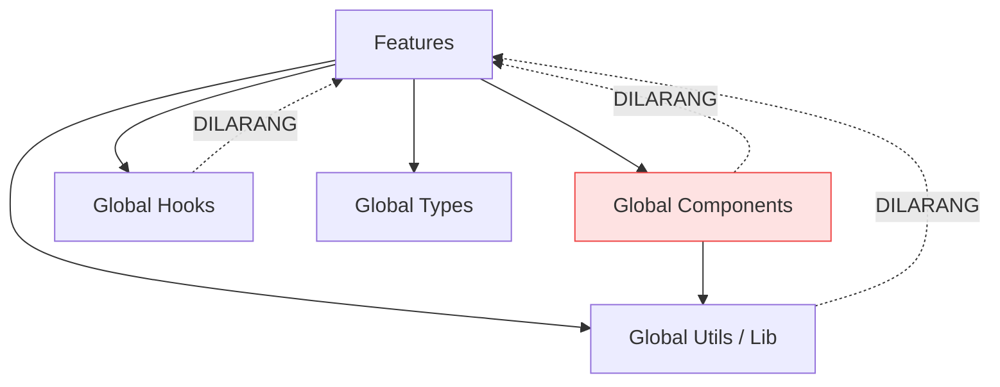

# Frontend Architecture & Directory Structure - RAFA Rental System

Dokumentasi rancangan arsitektur dan struktur direktori *(Folder Structure)* untuk proyek React SPA RAFA Rental System (Phase 4B).

---

## 1. Arsitektur Berbasis Fitur (Feature-Based Architecture)

Frontend menerapkan pendekatan *feature-based architecture*. Komponen, state, tipe data, dan hook yang secara spesifik merupakan bagian dari sebuah domain bisnis dienkapsulasi di dalam subdirektori domain tersebut (`src/features/`). Sementara itu, kode yang dibagikan secara global lintas fitur ditempatkan di root (`src/components`, `src/hooks`, dll).

### Keuntungan:
- Menghindari *giant folders* pada level root.
- Meningkatkan skalabilitas (*high cohesion, low coupling*).
- Memudahkan *onboarding* tim untuk memahami cakupan spesifik sebuah modul (misal: hanya fokus pada `features/booking`).

---

## 2. Struktur Direktori dan Tanggung Jawab

| Direktori | Tanggung Jawab |
|---|---|
| `app/` | Konfigurasi global aplikasi: inisialisasi Providers (Context, QueryClient, Theme), store Redux/Zustand global (bila ada), dan setup layout tingkat atas. |
| `components/` | Komponen presentasional dan UI yang **reusable secara global** dan *business-agnostic*. Dikelompokkan berdasarkan fungsi (`ui/`, `form/`, `feedback/`, `layout/`, `data-display/`). |
| `features/` | Modul domain bisnis. Setiap fitur memiliki ruang lingkup spesifik yang menaungi komponen, hook, service, dan tipe yang eksklusif untuk fitur tersebut. |
| `hooks/` | Custom React hooks yang dipakai lintas fitur (contoh: `useDebounce`, `useLocalStorage`, `useMediaQuery`). |
| `lib/` | Utilitas/konfigurasi *third-party libraries* (contoh: `axios` instace `api.ts`, konfigurasi tanggal day.js, konfigurasi format mata uang). |
| `routes/` | Deklarasi struktur navigasi dan *routing* aplikasi (React Router). |
| `services/` | Abstraksi API requests global atau interceptors HTTP yang tidak spesifik terhadap satu fitur (misal: *refresh token logic*). |
| `types/` | Definisi TypeScript interface / types global (`ApiResponse`, paginasi, model umum). |
| `utils/` | Fungsi-fungsi murni (*pure functions*) seperti formatter harga, manipulasi string, dan `cn` (Tailwind class merger). |

---

## 3. Struktur Detail `features/`

Telah disiapkan *placeholder* folder untuk setiap modul domain bisnis:

```
src/features/
├── auth/            # Login, register, profil, proteksi rute
├── equipment/       # Katalog model alat, manajemen unit fisik (admin)
├── recommendation/  # Antarmuka input rekomendasi dan hasil scoring
├── booking/         # Keranjang (cart), alur checkout, persetujuan admin
├── rental/          # Unit assignment, dispatch, handover (BAST)
├── timesheet/       # Input HM, persetujuan timesheet, riwayat revisi
├── invoice/         # Daftar tagihan, cetak PDF invoice
├── payment/         # Unggah bukti bayar, verifikasi mutasi
├── refund/          # Request refund, eksekusi manual, riwayat transfer
├── dashboard/       # Ringkasan/widget statistik umum
└── reports/         # Pivot/tabel agregasi pendapatan dan okupansi (owner)
```

Di dalam setiap fitur, disarankan menggunakan struktur standar internal:
`components/`, `hooks/`, `api/` (layanan HTTP), dan `types/`.

---

## 4. Konvensi Reusabilitas Komponen UI

Komponen yang diletakkan di `src/components/` **DILARANG** membawa logika atau status bisnis (*dumb components*).

### Contoh Benar:
- `Button` (Menerima properti `variant="primary"`, `onClick`, `disabled`)
- `Modal` (Komponen generik dengan slot/prop `title`, `content`, `footer`)
- `DataTable` (Komponen generik penerima kolom dan baris data)
- `StatusBadge` (Penerima `color` dan `label`)

### Contoh Salah (Anti-Pattern):
- `BookingButton` (Hardcode pemanggilan API Booking di dalam Button)
- `InvoiceModal` (Menyematkan State Invoice di dalam komponen Modal base)
- `ApprovePaymentButton`

Jika sebuah komponen memiliki fungsionalitas bisnis, letakkan komponen tersebut di bawah `src/features/{domain}/components/`.

---

## 5. Arah Dependensi (Dependency Direction)



- Komponen global **tidak boleh** meng-import apapun dari direktori `features/`.
- Fitur tidak boleh melakukan pemanggilan (import) ke *fitur lain* yang bersifat internal/privat. Jika sebuah komponen dalam satu fitur diperlukan oleh fitur lain, pindahkan komponen tersebut ke `src/components/` atau buat API publik (`index.ts`) dari folder asal.
